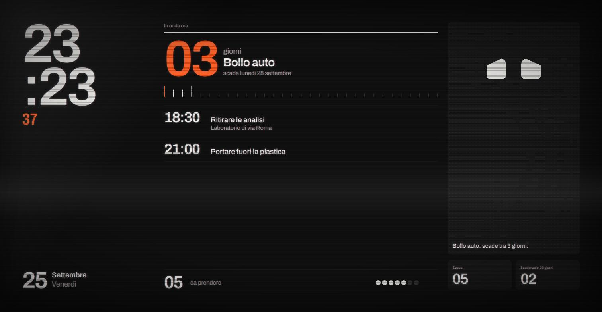
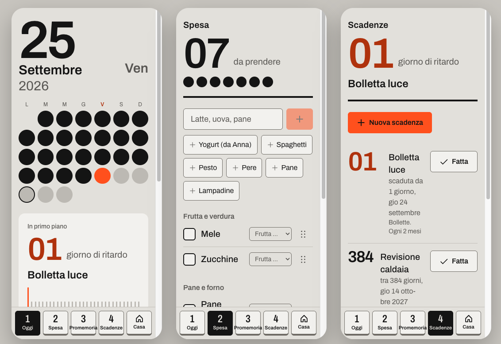

# Homeboard

Spesa, promemoria e scadenze di casa in un'unica app con tre facce:

- una **PWA** per il telefono, che funziona anche offline al supermercato e manda notifiche push;
- una **vista TV** a tutto schermo che gira su un Raspberry Pi dentro un televisore portatile Crezar degli anni '70;
- **Roby**, un volto animato che è la voce della TV e annuncia le cose.



| Il telefono | Il monoscopio (canale 5) |
|---|---|
|  |  |

## Cosa fa

- **Chiedi a Roby:** un campo unico nella schermata Oggi, in italiano come si parlerebbe: "latte e uova", "togli il pane", "ricordami domani alle nove di chiamare l'idraulico", "quando scade il bollo?", "ricorda che la chiave di scorta è da mia madre". Lo interpreta `packages/intents`, lo stesso codice che userà Roby a voce sul Raspberry:
  - regole e modelli di frase, senza rete né costi; le frasi sono in `packages/intents/src/corpus.test.ts`;
  - le azioni distruttive ("svuota la lista") chiedono conferma;
  - le frasi non capite finiscono in `unparsed_log`, per migliorare le regole.
- **Spesa:**
  - aggiunta rapida, anche di più cose insieme separate da virgole;
  - suggerimenti dalle cose usate più spesso;
  - reparti in ordine di supermercato, riordino a trascinamento;
  - aggiornamenti in tempo reale fra i telefoni della casa;
  - **funziona offline**: le modifiche vanno in coda e partono al ritorno della rete, con conflitti risolti da regole semplici e documentate.
- **Promemoria:** data e ora, ripetizioni giornaliere, settimanali (anche con giorni scelti), mensili, annuali o personalizzate. La notifica arriva all'ora giusta, anche con l'app chiusa.
- **Scadenze:** bollette, bollo, revisione, assicurazioni. Ripetizioni a mesi o anni (ogni 2 anni per la revisione) e avvisi in anticipo scelti per ognuna. "Fatta" apre da sola la scadenza successiva.
- **Timer:** li mette e li ferma Roby a voce, a casa; nel telefono si vede quanto manca, e se Roby non si sente da qualche minuto l'app lo dice.
- **Note:** le cose da ritrovare ("la chiave di scorta è da mia madre"), scritte qui o dette a Roby. Si cercano per parole anche offline; a Roby si chiede "dove sta la chiave di scorta?".
- **Premi e parla:** il tasto del microfono accanto al campo usa il riconoscimento vocale del browser (Chrome su Android, Safari su iOS) e passa dallo stesso interprete.
- **Casa condivisa, solo su invito:** la casa la crea chi è autorizzato, e il proprietario aggiunge le persone con la loro email (entrano da sole al primo accesso). Chi non è in elenco non può registrarsi. I televisori si abbinano con un codice.
- **La postazione di casa (`/casa`, sul Pi dentro la Crezar):** si usa solo a voce, lo schermo mostra e basta.
  - Un solo layout: a sinistra ora, Roby e lo stato del microfono (sempre visibile), a destra un pannello che cambia secondo un ordine di priorità: timer che suona, risposta appena data (30 secondi), timer attivi, promemoria entro un'ora o scadenza entro tre giorni, e a riposo il monoscopio.
  - Filtro CRT, neve e fruscio a ogni cambio di pannello, "fine delle trasmissioni" di notte.
  - Tutto arriva da `brain` sul Pi via WebSocket locale: la pagina non parla con Supabase e funziona anche senza internet.
- **Roby:** ascolta, pensa e parla (la bocca segue il volume della voce), preoccupato per una scadenza vicina, contento con la lista vuota, addormentato di notte, sorpreso quando arriva qualcosa di nuovo.

## Architettura

```
homeboard/                      workspace npm
├─ apps/web/                    Next.js 16 (App Router, TypeScript strict): la PWA e /casa, la vista del Pi → Vercel
│  └─ src/features/             spesa, promemoria, scadenze, casa, home, tv, auth
├─ packages/
│  ├─ core/                     logica pura condivisa: spesa, sincronizzazione offline, ricorrenze, protocollo del Pi
│  ├─ intents/                  interprete dei comandi: frase in italiano → intento validato (lo stesso su Pi e PWA)
│  └─ roby-face/                <roby-face>: web component del volto, senza dipendenze
├─ services/                    sul Raspberry
│  ├─ brain/                    Node: esegue i comandi, timer, copia locale SQLite ⇄ Supabase, WebSocket per /casa
│  └─ voice/                    Python: parola di attivazione, trascrizione, sintesi; da qui esce solo testo
├─ supabase/
│  ├─ migrations/               schema, RLS, pg_cron, pgvector
│  ├─ tests/                    test pgTAP delle policy
│  └─ functions/
│     ├─ _shared/               ricorrenze e pianificazione delle notifiche (TS puro, esposto come @homeboard/core)
│     └─ notify/                Edge Function: notifiche push di promemoria e scadenze
├─ device/                      Raspberry Pi: kiosk, tasti, schermo, voce, watchdog
└─ docs/                        input vocale (progetto) e immagini
```

- **Dati:** Supabase, cioè Postgres, Auth, Realtime, Edge Functions e pg_cron. Ogni tabella ha la Row Level Security:
  - i **membri** della casa leggono e scrivono;
  - il **Pi** è un utente anonimo abbinato alla casa con un codice: legge e scrive i dati di tutti i giorni (spesa, promemoria, scadenze, note, timer), ma non membri, casa o notifiche.
- **Offline:** la lista della spesa vive in IndexedDB (Dexie) con una coda di modifiche. Il service worker (Serwist) precarica l'app, così si apre senza rete.
- **Notifiche:**
  - ogni minuto pg_cron chiama la Edge Function `notify` con pg_net;
  - la funzione decide cosa è dovuto, registra ogni invio per non ripeterlo e manda le Web Push con le chiavi VAPID;
  - le chiavi private stanno solo nei segreti della funzione.
- **Ricorrenze:** un solo modulo TypeScript (`supabase/functions/_shared/recurrence.ts`) per la PWA e per la funzione.
  - Mesi e anni si contano dalla prima data: il 31 gennaio "ogni mese" dà 28 febbraio, poi 31 marzo.
  - Gli orari restano "da orologio" anche col cambio dell'ora legale.

### Offline e conflitti

Regole complete in [`features/shopping/sync.ts`](apps/web/src/features/shopping/sync.ts):

1. Vince l'ultima modifica **arrivata al server**, perché è il server a scrivere l'ora.
2. Finché una modifica è in coda, sullo schermo resta la tua.
3. Una cosa tolta dalla lista non torna.
4. La stessa cosa aggiunta da due telefoni offline si tiene una volta sola.
5. Ogni invio si può ripetere senza fare danni: gli id li genera il client e si inviano valori, non "inverti".

## Setup locale

Servono Node 22.18 o successivo e Docker (per Supabase in locale).

```sh
npm install
npx supabase start          # Postgres, Auth, Realtime, Edge Runtime e Mailpit in Docker
npx supabase db reset       # applica le migrazioni e supabase/seed.sql
```

**Variabili.** Parti dai due file d'esempio:

- `apps/web/.env.local`, da [`.env.example`](.env.example): URL e chiave *publishable* le stampa `npx supabase status`.
- `supabase/functions/.env`, da [`supabase/functions/.env.example`](supabase/functions/.env.example): le chiavi VAPID si generano con `npx web-push generate-vapid-keys`, e la pubblica va in entrambi i file.

**Avvio:**

```sh
npx supabase functions serve --env-file supabase/functions/.env   # la funzione notify (in un terminale)
npm run dev                                                       # la PWA su http://localhost:3000
```

- **Accesso:** l'email con il codice arriva in Mailpit, su <http://127.0.0.1:54324>.
- **La postazione:** senza Raspberry si prova col simulatore di brain, che usa l'interprete vero:
  ```bash
  npm run simulate -w @homeboard/brain            # poi apri http://localhost:3000/casa e scrivi frasi nel terminale
  npm run simulate -w @homeboard/brain -- --demo  # un giro di tutti i pannelli
  ```
  `/help` nel terminale elenca i comandi (ascolto, microfono spento, notte, abbinamento, senza internet…). `/cruscotto` mostra la home della PWA con dati d'esempio.
- **Il service worker** in sviluppo è spento. Per provare PWA e offline: `npm run build && npm run start -w @homeboard/web`.

## Comandi

| Comando | Cosa fa |
|---|---|
| `npm run dev` / `npm run build` | sviluppo / build della PWA (compila anche `roby-face`) |
| `npm run lint` / `npm run typecheck` | ESLint / TypeScript |
| `npm test` | test unitari con `node --test`: ricorrenze, sincronizzazione offline, pianificazione delle notifiche, spesa, palinsesto della TV |
| `npm run test:db` | test pgTAP delle policy RLS e delle funzioni del database (serve Supabase locale) |
| `npm run db:reset` / `npm run db:types` | database locale da zero / tipi TypeScript dallo schema |

## Variabili d'ambiente

| Dove | Variabile | Cosa |
|---|---|---|
| PWA (Vercel e `apps/web/.env.local`) | `NEXT_PUBLIC_SUPABASE_URL` | URL del progetto Supabase |
| | `NEXT_PUBLIC_SUPABASE_PUBLISHABLE_KEY` | chiave pubblica (publishable) |
| | `NEXT_PUBLIC_VAPID_PUBLIC_KEY` | chiave VAPID pubblica, per iscrivere il browser alle push |
| Edge Function (`supabase secrets` e `supabase/functions/.env`) | `VAPID_PUBLIC_KEY`, `VAPID_PRIVATE_KEY` | coppia VAPID |
| | `VAPID_SUBJECT` | `mailto:` di contatto per i servizi push |
| | `NOTIFY_SECRET` | segreto con cui pg_cron chiama la funzione |
| Database (Vault) | `notify_url` | indirizzo della funzione `notify` |
| | `notify_secret` | lo stesso valore di `NOTIFY_SECRET` |

`SUPABASE_URL` e `SUPABASE_SERVICE_ROLE_KEY` nella funzione li mette Supabase da solo.

## Deploy

### Supabase (progetto cloud, piano gratuito)

1. Crea il progetto dalla dashboard, poi collegalo e applica le migrazioni:
   ```sh
   npx supabase login
   npx supabase link --project-ref <ref>
   npx supabase db push
   ```
2. **Auth.** Puoi farlo con `npx supabase config push`, che manda la sezione `[auth]` di `config.toml`, oppure dalla dashboard:
   - Site URL e redirect `https://<app>/**`;
   - accesso anonimo attivo (serve alla TV);
   - template email da `supabase/templates/`.

   L'SMTP incluso manda poche email all'ora: per l'uso vero conviene collegare un SMTP gratuito come Resend.
3. **La funzione:**
   ```sh
   npx supabase secrets set VAPID_PUBLIC_KEY=… VAPID_PRIVATE_KEY=… VAPID_SUBJECT=mailto:… NOTIFY_SECRET=…
   npx supabase functions deploy notify --no-verify-jwt
   ```
4. **Il giro ogni minuto.** Nell'SQL editor, una volta sola:
   ```sql
   select vault.create_secret('https://<ref>.supabase.co/functions/v1/notify', 'notify_url');
   select vault.create_secret('<NOTIFY_SECRET>', 'notify_secret');
   ```

### Vercel

Importa il repository, con **Root Directory** `apps/web` (il workspace npm si installa dalla radice). Imposta le tre variabili `NEXT_PUBLIC_*` e fai il deploy.

### Dopo il deploy

1. **Autorizzati a creare la casa:** nel Table Editor di Supabase, tabella `signup_allowlist`, aggiungi la tua email (in minuscolo) con `can_create_household` attivo.
2. **Sul telefono:** apri l'app, accedi, crea la casa, e da *Impostazioni → Aggiungi una persona* aggiungi gli altri con la loro email.
3. **Su iPhone:** *Condividi → Aggiungi alla schermata Home*. Le notifiche web su iOS arrivano solo così.
4. **Notifiche:** attivale in *Casa*.
5. **Raspberry:** segui [`device/README.md`](device/README.md), con `TV_URL=https://<app>/casa`, poi abbina la TV da *Impostazioni → Abbina una TV*.

Sul piano gratuito il progetto Supabase si ferma dopo 7 giorni senza attività. Il battito della TV, una richiesta al minuto, dovrebbe bastare a tenerlo attivo: da verificare nella prima settimana. Se non basta, si aggiunge un keepalive.

## Roby

Il volto è un pacchetto a sé, [`packages/roby-face`](packages/roby-face). Si usa con `<roby-face expression="happy">`, `speak()` con la voce del browser o un endpoint audio, e gli eventi di inizio e fine parlato. Non ha dipendenze e si può usare in qualsiasi sito. Il motore viene da [Roby](https://roby-bot.vercel.app).

## Prossimi passi

- [Input vocale](docs/input-vocale.md): progettato, da implementare. Si parte dall'aggiunta in linguaggio naturale ("latte e uova domani"), che serve anche senza microfono.
- Roby come prodotto a sé: temi e integrazione in chatbot e siti. Licenza da decidere prima di pubblicarlo su npm.
